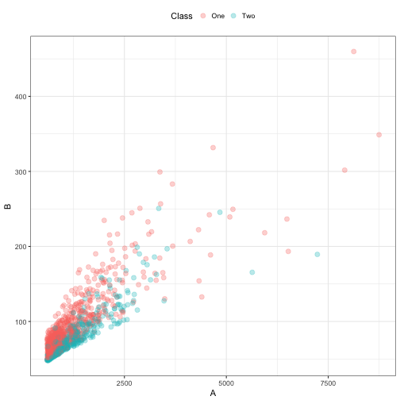

# Data Recipes


This is a document to explore an approach to pre-processing data for modeling. The idea is to define a plan/recipe/blueprint that can be used to eventually create a design matrix,  outcome array, or other collections of data.

## Definitions

* __variables__ are the original data columns in a data frame or tibble. For example, in the formula `Y ~ A + B + A:B`, the variables are `A`, `B`, and `Y`. 
* __roles__ define how variables will be used in the model. Examples are: `predictor` (independent variables), `response`, and `case weight`. This is meant to be open-ended and extensible. Some rules will exist such as "outcomes must be main effects" (e.g. not interactions) or "certain operations can only be used on predictors", etc. 
* __features__ are columns in a design matrix such as `A`, `B`, and `A:B`. These can be other derived entities that are grouped such a a set of principal components or a set of columns that define a basis function for a variable. These are synonymous with the terms in a model. Variables that have `predictor` roles would automatically be main effect features.  

## The General Process

(I'm using the cooking analogy a bit much)

To write a recipe, the process would be:
  
1. Define the variables and their roles. This can be done in the absence of any data set. 
1. By default, the predictors are considered main effects for the model. If more features are needed they can be added by a sequence of __actions__, which are operations on one or more variables or features. For example, creating an interaction effect or logging a variable are actions. Lists of actions are below. 
1. When the recipe is complete, an initial data set can be used to validate or __check__ the recipe. This evaluates common roles based on the data types (e.g. logging a categorical predictor). This process might eliminate or alter actions. Note that no statistical quantities have been estimated so some rules cannot be validated until the final data types of all features (existing or derived) are available. The checking process can also find logical inconsistencies (for example, centering the data then estimating a Box-Cox transformation). This step might be optional but we would want to avoid duing this repeatedly (i.e. during resampling)

The recipe is __cooked__ (.i.e. trained) from a data set. Here, the actions are taken with the training set and all of the statistical quantities are estimated. At this point, any derived features are defined such as creating columns for interactions or the determination of the principal components. Perhaps we could call this the __meal__.

The meal is then __served__ to a data set. This applies the actions to a data set. The data could be the original data set or a new set of data points being predicted.


### Actions

(Potential synonyms for "actions": steps, operations, tactics, procedures, activities, tasks)

Below are example classes of actions and their characteristics. Each action might replace the existing features, remove features, or add derived features. They may also affect the rows of the data set too.
                                                                                                  
* *standardization* (replacement, univariate): centering, scaling, and other re-encoding of individual features. 
* *interactions* or *nesting* (derived, multivariate)
* *imputation* (replacement, univariate): models or rules are used to replace missing features. 
* encoding *dummy variables* from categorical data (derived, univariate)
* *transformations* of data (replacement, uni- or multivariate): this includes logging, Box-Cox, arc-sin, spatial sign or other transformations of data. This also encompasses cases where a date variable is transformed into one or more features (e.g. day of the week, month number).
* *binning* (derived, univariate): the unfortunate process of creating categories from numeric data
* feature *extraction* (derived, multivariate): PCA, ICA, autoencoders, basis functions, and other procedures that estimate new features from the original data
* *filters* (removal, uni- or multivariate): filters on zero-variance features or for reducing correlations between predictors. 
* *subsampling* (changes to rows, uni- or multivariate): procedures to remove or create new *rows* of the data set. Examples are down-sampling or SMOTE sampling procedures for class imbalances. 


### Tags

Some sugar to be added later: a _tagging_ system where groups of variables can be referenced in lieu of a character vector.  For example, if you are modeling data for the purpose of predicting credit scores, you could have groups of variables that are related to demographic data on a potential lendee, some that are related to the requested loan, or bank account data. 

These groups of variables can be grouped by tags, although they need not be mutually exclusive. Also, tags for data type (e.g. `::num::` for numeric, `::cat::` for categorical, etc.) can be declared and instantiated once data is available. 

The tags could also include features that have not been created yet and may have an undefined set of members (e.g. `::pc::` for the principal components). Finally, we can use them to select specific types of features like `::predictor::`, `::interactions::` or `::ns::` 

## An Example

Some data in the `caret` package will be used but thinned down to two predictors (`A` and `B`) and an outcome that is a binary category with classes `One` and `Two`. 

There are two data sets: `raw_train` with 1009 data points and `raw_test` with 1010 samples.


```r
summary(raw_train)
```

```
##        A                B          Class    
##  Min.   : 603.8   Min.   : 47.74   One:636  
##  1st Qu.: 779.9   1st Qu.: 64.37   Two:373  
##  Median :1027.2   Median : 79.02            
##  Mean   :1302.5   Mean   : 91.61            
##  3rd Qu.:1505.2   3rd Qu.:103.24            
##  Max.   :8746.1   Max.   :459.77
```

A look at the training data:


```r
theme_set(theme_bw())
ggplot(raw_train, aes(x = A, y = B, color = Class)) + 
  geom_point(alpha = .3, cex = 2.5)  + 
  theme(legend.position = "top")
```




Let's create an initial recipe:


```r
preds_vars <- c("A", "B")

# Start from scratch
basic <- recipe()
basic <- basic %>% 
  add_response("Class") %>%
  add_predictor(preds_vars)

# eventually we can setup something like:
basic <- as.recipe(Class ~ A + B)
# or
frame <- model.frame(Class ~ A + B, data = raw_train)
basic <- as.recipe(frame)
```

These predictors are both pretty right-skewed so maybe start with

```r
basic <- basic %>% log_trans(features = pred_vars) 
# or 
basic <- basic %>% log_trans(A, B)
# or 
basic <- basic %>% log_trans(~ A + B)
```

We can also plan some simple normalization

```r
normalized <- basic %>% standardize(features = pred_vars, type = c("center", "scale"))
```

Also, since they are pretty correlated, we can schedule the first PCA component to be used based on _any_ numeric features created thus far

```r
with_comp <- normalized %>% pca_extract(features = "::num::", comps = 1)
```
Alternatively, we add an interaction term. If this were an interaction between two factors, we might want to tag the resulting columns so that we can refer to the group later: 

```r
two_way_int <- normalized %>% interact(formula = ~ A:B, tag = "AB int")
```

Now check the recipe with some actual data

```r
with_comp <- check(with_comp, data = raw_train)
```

Unless there are any critical issues, we can then compute the means, standard deviations, and PCA component to be used later:

```r
data_stats <- compute(with_comp, data = raw_train)
```
and then apply these computations to the data sets. I'm not sure what verb is best here so I'll just used `predict`: 

```r
train_features <- predict(data_stats, raw_train)
test_features  <- predict(data_stats, raw_test)
```

 
