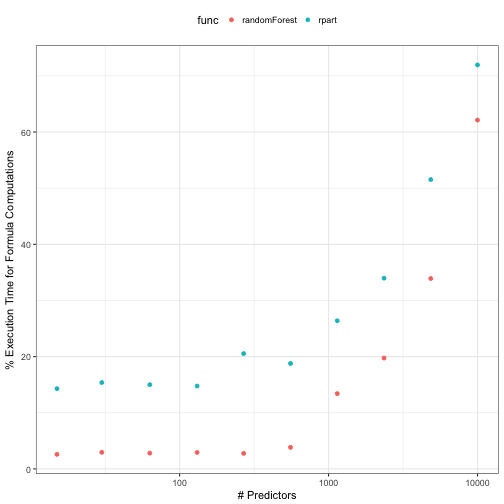
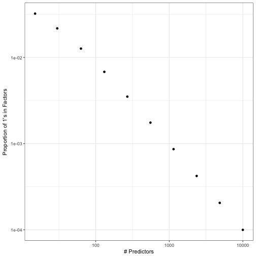

# Formulas


## Introduction

The formula interface to symbolically specifying blocks of data is ubiquitous in R. It is commonly used to generate _design matrices_ for modeling function (e.g. `lm`). In traditional linear model statistics, the design matrix is the two dimensional representation of the predictor set where instances of data are in rows and variable attributes are in columns (a.k.a. the _X_ matrix). 

A simple motivating example uses the inescapable iris data in a linear regression model: 


```r
mod1 <- lm(Sepal.Width ~ Petal.Width + log(Petal.Length) + Species, 
           data = iris, subset = Sepal.Length > 4.6)
```

While the purpose of this code chunk is to fit a linear regression models, the formula is used to specify the symbolic model as well as generating the intended design matrix. Note that the formula method defines the columns to be included in the design matrix as well as which rows should be retained. 

Formulas are used in R beyond specifying statistical models and their use has been growing over time (see [this](https://cran.r-project.org/web/packages/lazyeval/vignettes/lazyeval.html) or [this](http://rmhogervorst.nl/cleancode/blog/2016/06/13/NSE_standard_evaluation_dplyr.html)). An example for data aggregation is used later as an example. 

This document is intended to walk through the mechanics of how some modeling functions use formulas to make a design matrix. Additionally, there is a discussion of the limitations of the standard formula interface for this purpose. `lm` will be used to illustrate the details but the syntactical minutiae is likely to be different from function to function (even within base R). 

## Formulas and Terms

`lm` initially uses the formula and the appropriate environment to translate the relationships between variables to creating a data frame containing the data. R has a fairly [standard set of operators](https://stat.ethz.ch/R-manual/R-devel/library/stats/html/formula.html) that can be used to create a matrix of predictors for models. 

We will start by looking at some of the internals of `lm` (circa December 2016).

### Preparing for the Model Frame

The main tools used to get the design matrix are the `model.frame` and `model.matrix` functions. The definition and first few lines of `lm` are:


```r
function (formula, data, subset, weights, na.action, method = "qr", 
    model = TRUE, x = FALSE, y = FALSE, qr = TRUE, singular.ok = TRUE, 
    contrasts = NULL, offset, ...)  {
  
    ret.x <- x
    ret.y <- y
    cl <- match.call()
    mf <- match.call(expand.dots = FALSE)
    m <- match(x = c("formula", "data", "subset", "weights", "na.action", "offset"), 
               table = names(mf), nomatch = 0L)
    mf <- mf[c(1L, m)]
    mf$drop.unused.levels <- TRUE
    mf[[1L]] <- quote(stats::model.frame)
    mf <- eval(expr = mf, envir = parent.frame())
```

The goal of this code is to manipulate the formula and other arguments into an acceptable set of arguments to the `model.frame` function in the `stats` package. The code will modify the call to `lm` to use as the substrate into `model.frame`, which has many similar arguments (e.g. `formula`, `data`, `subset`, and `na.action`) and some others that are not. 

The object `mf` is initially created to mirror the original call. After executing `match.call(expand.dots = FALSE)`, our original call generates a value of 
```
lm(formula = Sepal.Width ~ Petal.Width + log(Petal.Length) + Species, 
   data = iris, subset = Sepal.Length > 4.6)
```
and `class(mf)` has a value of `"call"`. Note that the first element of the call, `mf[[1L]]`, has a value of `lm` with the class of `name`.  The next few lines remove any arguments to `lm` that are not arguments to `model.frame` and adds another (`drop.unused.levels`). Finally, the call is modified by replacing the first element of the call (`lm`) to `stats::model.frame`. Now, `mf`, has a value of 

```r
stats::model.frame(formula = Sepal.Width ~ Petal.Width + log(Petal.Length) + Species, 
                   data = iris, 
                   subset = Sepal.Length > 4.6, 
                   drop.unused.levels = TRUE)
```

### Creating the Model Frame and Terms

When this code is executed using `eval(expr = mf, envir = parent.frame())`, the `model.frame` function returns

 > A `data.frame` containing the variables used in formula plus those specified in `...`. It will have additional attributes, including "`terms`" for an object of class "`terms`" derived from `formula`, and possibly "`na.action`" giving information on the handling of `NA`s (which will not be present if no special handling was done, e.g. by `na.pass`).

For our particular call, the first six values of `mf` are
```
  Sepal.Width Petal.Width log(Petal.Length) Species
1         3.5         0.2             0.336  setosa
2         3.0         0.2             0.336  setosa
3         3.2         0.2             0.262  setosa
5         3.6         0.2             0.336  setosa
6         3.9         0.4             0.531  setosa
8         3.4         0.2             0.405  setosa
```
Note that : 

 * all of the columns are present, predictors _and_ response,
 * the filtering defined by the `subset` command is executed here (note the row names above),
 * the `Petal.Length` has been logged and that the column name is not a valid name, and
 * the species variable has not generated any dummy variables. 

If weights or an offset was used in the model, the resulting model frame would also include these. 

As alluded to above, `mf` has several attributes and includes one that would not normally be associated with a data frame (e.g. `"terms"`). The `terms` object contains the data that defines the relationships between variables in the formulas as well as any transformations of the individual predictors (e.g. `log`). For our original model:

```r
mod1$terms
```

```
## Sepal.Width ~ Petal.Width + log(Petal.Length) + Species
## attr(,"variables")
## list(Sepal.Width, Petal.Width, log(Petal.Length), Species)
## attr(,"factors")
##                   Petal.Width log(Petal.Length) Species
## Sepal.Width                 0                 0       0
## Petal.Width                 1                 0       0
## log(Petal.Length)           0                 1       0
## Species                     0                 0       1
## attr(,"term.labels")
## [1] "Petal.Width"       "log(Petal.Length)" "Species"          
## attr(,"order")
## [1] 1 1 1
## attr(,"intercept")
## [1] 1
## attr(,"response")
## [1] 1
## attr(,".Environment")
## <environment: R_GlobalEnv>
## attr(,"predvars")
## list(Sepal.Width, Petal.Width, log(Petal.Length), Species)
## attr(,"dataClasses")
##       Sepal.Width       Petal.Width log(Petal.Length)           Species 
##         "numeric"         "numeric"         "numeric"          "factor"
```
The `terms` object will be used to generate design matrices on new data (e.g. samples being predicted). 

### Creating the Design Matrix

The `lm` code has some additional steps to save the model terms and do generate the design matrix: 

```r
mt <- attr(x = mf, which = "terms")
x <- model.matrix(object = mt, data = mf, contrasts.arg = contrasts)
```
The `model.matrix` function uses the data in the `terms` object to generate any interactions and/or dummy variables from factors. This work is mostly accomplished by a C routine. 

# The Predictive Nature of the `terms`

In the previous example, the log transformation is applied to one of the columns. When using an inline function inside a formula, this transformation will be applied to the current data as well as any future data points (say via `predict.lm`). The same workflow is used where a model frame is used with the `terms` object and `model.matrix`. 

However, there are some operations that can be specified in a formula that require statistical estimates. Two examples: 

* a natural spline (`splines::ns`) takes a numeric variable, does some computations, and expands that variable into multiple features that can be used to model that predictor in a nonlinear fashion 
* orthogonal polynomials (`stats::poly`) is a basis expansion that takes a single predictor and produces new columns that correspond to the polynomial degree. 

As an example of natural splines: 

```r
library(splines)
pwidth_ns <- ns(iris$Petal.Width[1:100], df = 2)
tail(pwidth_ns)
```

```
##            1       2
##  [95,] 0.539  0.1326
##  [96,] 0.563  0.0260
##  [97,] 0.539  0.1326
##  [98,] 0.539  0.1326
##  [99,] 0.577 -0.0662
## [100,] 0.539  0.1326
```
`ns` returns multiple elements: the basis function spline results (shown just above) and the data required to generate them for new data (in the attributes). 

```r
attributes(pwidth_ns)
```

```
## $dim
## [1] 100   2
## 
## $dimnames
## $dimnames[[1]]
## NULL
## 
## $dimnames[[2]]
## [1] "1" "2"
## 
## 
## $degree
## [1] 3
## 
## $knots
## 50% 
## 0.8 
## 
## $Boundary.knots
## [1] 0.1 1.8
## 
## $intercept
## [1] FALSE
## 
## $class
## [1] "ns"     "basis"  "matrix"
```
It turns out that the only statistics required to produce new spline results are the `knots`, `Boundary.knots`, and `intercept` attributes. When new data are predicted, those statistical quantities are used: 

```r
tail(predict(pwidth_ns, iris$Petal.Width[101:150]))
```

```
##             1     2
## [45,] -0.0344 1.799
## [46,]  0.0671 1.513
## [47,]  0.2702 0.941
## [48,]  0.2194 1.084
## [49,]  0.0671 1.513
## [50,]  0.3210 0.798
```
Now, getting back to formulas, we can include a function like this inline:

```r
mod2 <- lm(Sepal.Width ~ ns(Petal.Width, df = 2) + Species, data = iris)
```
The resulting `terms` object saves the model specification and also the values required to reproduce the spline basis function. The `terms` object contains an attribute that is misleadingly named `predvars` that has this information: 

```r
attr(x = mod2$terms, which = "predvars")
```

```
## list(Sepal.Width, ns(Petal.Width, knots = 1.3, Boundary.knots = c(0.1, 
## 2.5), intercept = FALSE), Species)
```

```r
## The part with `ns` is in the _third_ element:
attr(x = mod2$terms, which = "predvars")[[3]]
```

```
## ns(Petal.Width, knots = 1.3, Boundary.knots = c(0.1, 2.5), intercept = FALSE)
```
When `predict.lm` is invoked with a new data set, the terms are passed to `model.frame` and the `predvars` are evaluated on the new data, e.g. 

```r
eval(attr(x = mod2$terms, which = "predvars")[[3]], envir = head(iris))
```

```
##           1       2
## [1,] 0.0635 -0.0422
## [2,] 0.0635 -0.0422
## [3,] 0.0635 -0.0422
## [4,] 0.0635 -0.0422
## [5,] 0.0635 -0.0422
## [6,] 0.1878 -0.1226
## attr(,"degree")
## [1] 3
## attr(,"knots")
## 50% 
## 1.3 
## attr(,"Boundary.knots")
## [1] 0.1 2.5
## attr(,"intercept")
## [1] FALSE
## attr(,"class")
## [1] "ns"     "basis"  "matrix"
```

In summary, R's formula interface works by exploiting the original formula as a general expression and the `terms` object is where most of the information about the design matrix are stored. 

Finally, it is possible to include more complex operations in the formula. For example, two techniques for imputation in predictive models are using tree ensembles and _K_-nearest neighbors. In each case, a model can be created to impute a predictor and this model also could be embedded into `predvars` as long as the prediction function can be exploited as an expression. 

## Limitations of the Current Framework

Despite the elegance and convenience of the formula method, there are some aspects that are limiting. 

### Limitations to Extensibility

The formula interface does have some limitations:

* Overly verbose with many operations on many variables (try logging 50 variables via a formula)
* The `predvars` aspect limits the utility of the operations. Suppose a formula had: `knn_impute(x1) + knn_impute(x2)`. Do we embed the training set twice in `predvars`? 
* Operations are constrained to single columns or features (excluding interaction specification). For example, you cannot do

```r
lm(y ~ pca(x1, x2, x3), data = dat)
## or nested functions 
lm(y ~ pca(scale(x1), scale(x2), scale(x3)), data = dat)
```

### Everything Happens at Once

Some of our data operations might be sequential. For example, it is not unreasonable to have predictors that require:

 1. imputation of a missing value
 2. centering and scale
 3.  conversion to PCA scores

Given that the formula method operations happen (in effect) at once, this workflow requires some sort of custom solution. While `caret::preProcess` was designed for this sequence of operations it does so in a single call, as opposed to a progression of steps exemplified by `ggplot2`,  `dplyr`, or `magrittr`. 

Allowing a series of steps to be defined in order is more consistent with how data analysis is conducted but does raise the complexity of the underlying implementation. For example, `caret::preProcess` dictates the possible sequence of tasks to be:  filters, single variable transformations, normalizations, imputation, signal extraction, and spatial sign. This avoids nonsensical sequences that center the data before applying a Box-Cox calculation (which requires positive data).  


### Formulas and Wide Datasets

The `terms` object saves a matrix with as many rows as formula variables and at least as many columns (depending on interactions, etc). Most of this data is zero and a non--sparse representation is used. The current framework was built in a time where there was more focus on interactions, nesting and other operations on a small scale.

It is unlikely that models would have hundreds of interaction terms but now it is not uncommon to have hundreds or thousands of main effects. As the number of predictors increases, this takes up an inordinate amount of execution time. For simple  `randomForest` or `rpart` calls, the formula/`terms` work can be most of the execution time. For example, we can calculate how much time functions spend generating the model matrix relative to the total execution time. For `rpart` and `randomForest`, we used the default arguments and did the calculations with a simulated data set of 200 data points and varying numbers of predictors:   



This is especially problematic for ensemble models. For example, `ipred:::ipredbagg` creates an ensemble of `rpart` trees. Since `rpart` only has a formula method, the footprint of the bagged model object can become very large if _X_ trees are contained in the ensemble.  Alternatively, `randomForest.formula` takes the approach of generating the `terms` once and feeds the model frame to `randomForest.default`. This does not work for `rpart` since there is no non-formula method exposed. Some functions (e.g. `lm`, `survival::coxph`) have arguments that can be used to prevent the `terms` and similar objects from being returned. This saves space but prevents new samples from being predicted. A little more detail can be found [here](https://developer.r-project.org/model-fitting-functions.html). 

One issue is the `"factors"` attribute of the `terms` object. This is a non-sparse matrix that has a row for each predictor in the formula and a column for each model term (e.g. main effects, interactions, etc.). The purpose of this object is to know which predictors are involved in which terms. 

The issue is that this matrix can get very large and usually has a high proportion of zeros. For example:

```r
mod3 <- lm(Sepal.Width ~ Petal.Width + Petal.Length*Species, data = iris)
fact_mat <- attr(mod3$terms, "factors")
fact_mat
```

```
##              Petal.Width Petal.Length Species Petal.Length:Species
## Sepal.Width            0            0       0                    0
## Petal.Width            1            0       0                    0
## Petal.Length           0            1       0                    1
## Species                0            0       1                    1
```
As the number of predictors increases, the rate of ones is likely to approach a value close to zero vey quickly. For example:



Again, it is doubtful that a model with a large number of predictors will have many high level interactions (see the [Pareto principle applied to modeling](https://en.wikipedia.org/wiki/Sparsity-of-effects_principle)).
 
### No Recycling

As a corollary to the point above, there is not way to recycle the `terms` between models that share the same formula and data/environment. For example, if I fit a CART model to a data set with many predictors, the random forest model (theoretically) shouldn't need to recreate the same `terms` information about the design matrix. This is currently feasible in R but there is no real existing infrastructure, such as methods, to do so. 

 
### Variable Roles

Some packages have implemented extensions of the basic formula. For example, there are cases when formula are needed for specific sub-models. For example, a random coefficient model can be fit with the `lmer` function. In this case, a model is specified for a particular clustering variable (e.g. a subject in a clinical trial). The code is an example of how `lmer` syntax works:

```r
# ?lme4::lmer
lmer(Reaction ~ Days + (Days | Subject), data = sleepstudy)
```
Here `Subject` is important to the model fitting routine but not as a predictor. Similarly, the [Bradley-Terry model](https://www.jstatsoft.org/article/view/v012i01/v12i01.pdf) can be used to model competitions and contests. A model a set boxers in a series of contests can include terms for their reach:

```r
BTm(outcome = 1, player1 = winner, player2 = loser, 
    formula = ~reach[..] + (1 | ..), 
    data = boxers)
```
Another extension of basic formulas comes from the [`modeltools`](https://cran.r-project.org/package=modeltools) and [`mboost`](https://cran.r-project.org/package=mboost) packages. The function `mboost::mob` fits a tree-based model with regression models in the terminal nodes. For this model, a separate list of predictors are used as _splitting_ variables (to define the tree structure) and another set of _regression_ variables that are modeled in the terminal nodes. An example of this call is: 

```r
# mboost::mob (using the modeltools package for formulas)
mob(diabetes ~ glucose | pregnant + mass +  age,
    data = PimaIndiansDiabetes)
```
The commonality between these three examples is that there are variables that are critical to the model but do not play the role of standard regression terms. For `lmer`, `Subject` is the independent experimental unit. For `mob`, we have variables to be used for splitting, etc. 

There are similar issues on the left-hand side of the formula. When there are multivariate outcomes, different packages have different approaches: 

```r
# ?aggregate the mean of two variables by month
aggregate(cbind(Ozone, Temp) ~ Month, data = airquality, mean)

# grouped binomial data:
glm(cbind(events, nonevents) ~ x, family = binomial)

# pls::plsr, 
pls(sensory ~ chemical, data = oliveoil)
# sensory and chemical are 2D arrays in the oliveoil data frame
```

The overall point here is that, for the most part, the formula method assumes that there is one variable on the left-hand side of the tilde and that the variables on the right-hand side are predictor (exceptions are discussed below). One can envision other roles that columns could play in the analysis of data. Besides the examples given above, variables could be used for  

 * stratification 
 * measuring model performance (e.g. loan amount to compute expected loss)
 * conditioning variables (e.g. [`lattice`](https://cran.r-project.org/package=lattice))
 * outcomes
 * case weights
 * offsets
 * random effects

The last three items on this list are currently handled in formulas as "specials" or have existing functions. For example, when the model function has a `weights` argument, the current formula/`terms` frame work uses a function (`model.weights`) to extract the weights and also makes sure that the weights are not included as covariates. The same is true for offsets. 

 
## Related Packages and Functions

The [`modeltools`](https://cran.r-project.org/package=modeltools) package. "A collection of tools to deal with statistical models. The functionality is experimental and the user interface is likely to change in the future. "

The [`Formula`](https://cran.r-project.org/package=Formula) package is the more recent version by the same authors and is described as "Infrastructure for extended formulas with multiple parts on the right-hand side and/or multiple responses on the left-hand side." In this package, more extensive formulas can be used:

```r
library(Formula)
Formula(y1 + y2 | log(y3) ~ x1 + I(x2^2) | 0 + log(x1) | x3 / x4)
```

```
## y1 + y2 | log(y3) ~ x1 + I(x2^2) | 0 + log(x1) | x3/x4
```
 


   
